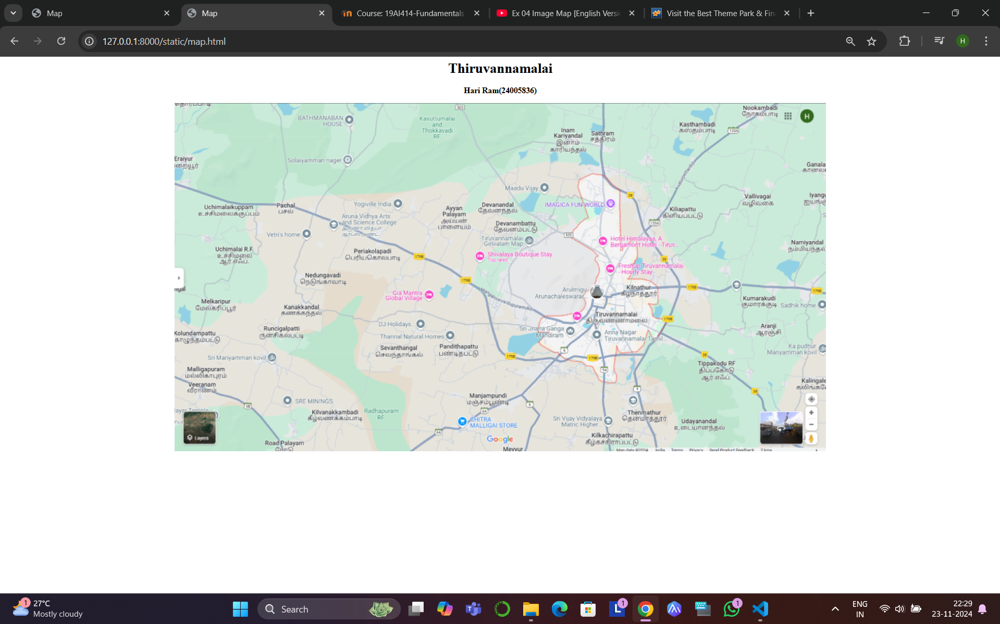
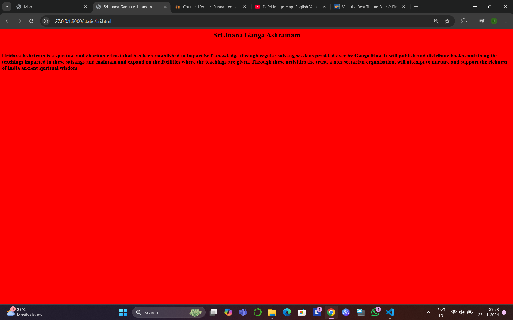
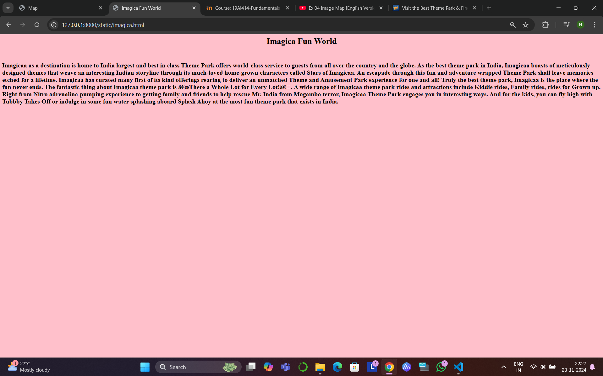
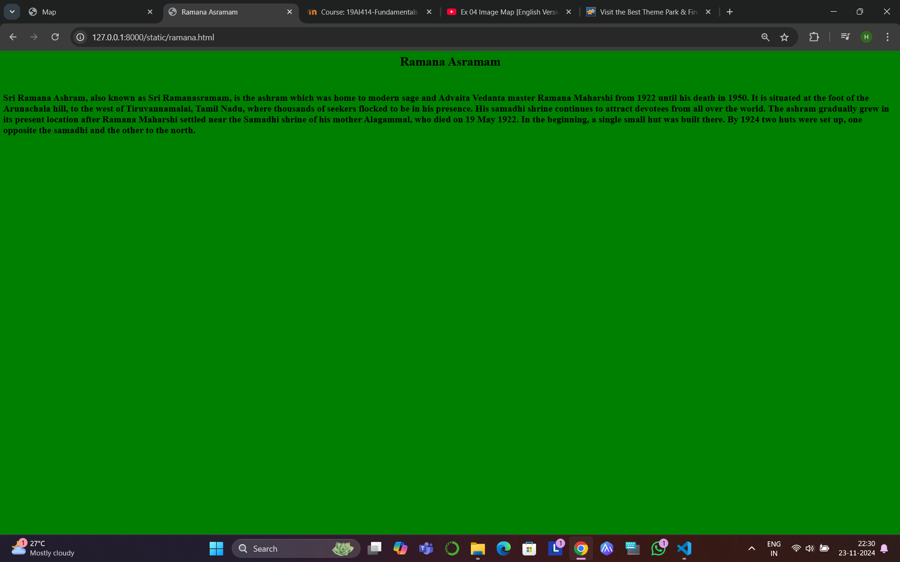
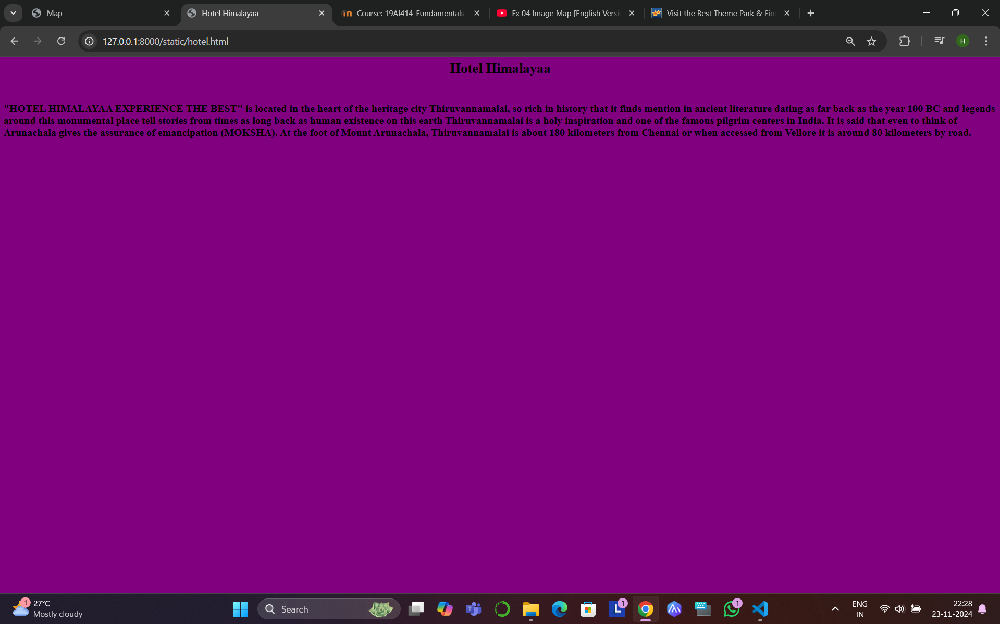
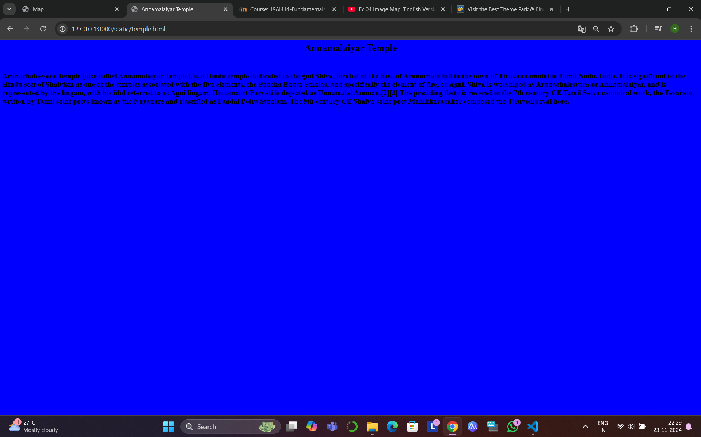

# Ex04 Places Around Me
## Date:23.11.2024 

## AIM
To develop a website to display details about the places around my house.

## DESIGN STEPS

### STEP 1
Create a Django admin interface.

### STEP 2
Download your city map from Google.

### STEP 3
Using ```<map>``` tag name the map.

### STEP 4
Create clickable regions in the image using ```<area>``` tag.

### STEP 5
Write HTML programs for all the regions identified.

### STEP 6
Execute the programs and publish them.

## CODE
```
map.html

<html>
    <head>
        <title>
            Map
        </title>
    </head>
    <body>
        <h1 align="center">
            Thiruvannamalai
        </h1>
        <h3 align="center">
            Hari Ram(24005836)
        </h3>
    </body>
        <center>
            

            <map name="image-map">
                <area target="_blank" alt="Annamalaiyar Temple" title="Annamalaiyar Temple" href="temple.html" coords="964,438,47" shape="circle">
                <area target="_blank" alt="Imagica " title="Imagica " href="fun.html" coords="952,208,1048,255" shape="rect">
                <area target="_blank" alt="Hotel Himalaya" title="Hotel Himalaya" href="hotel.html" coords="987,321,34" shape="circle">
                <area target="_blank" alt="Ashramam" title="Ashramam" href="sri.html" coords="870,504,936,550" shape="rect">
                <area target="_blank" alt="Ramanar Ashramam" title="Ramanar Ashramam" href="ramana.html" coords="995,520,977,553,1013,565,1038,534,1022,509" shape="poly">
            </map>


</html>

sri.html

<html>
    <head>
        <title>
            Sri Jnana Ganga Ashramam
        </title>
    </head>
    <body bgcolor="red">
        <h1 align="center">
            Sri Jnana Ganga Ashramam
        </h1>
        <br>
        <h2>
            Hridaya Kshetram is a spiritual and charitable trust that has been established to impart Self-knowledge through regular satsang sessions presided over by Ganga Maa. It will publish and distribute books containing the teachings imparted in these satsangs and maintain and expand on the facilities where the teachings are given. Through these activities the trust, a non-sectarian organisation, will attempt to nurture and support the richness of India ancient spiritual wisdom.
        </h2>
    </body>
</html>

imagica.html

<html>
    <head>
        <title>
            Imagica Fun World
        </title>
    </head>
    <body bgcolor="pink">
        <h1 align="center">
            Imagica Fun World
        </h1>
        <br>
        <h2>
            Imagicaa as a destination is home to India largest and best in class Theme Park offers world-class service to guests from all over the country and the globe. As the best theme park in India, Imagicaa boasts of meticulously designed themes that weave an interesting Indian storyline through its much-loved home-grown characters called Stars of Imagicaa.
            An escapade through this fun and adventure wrapped Theme Park shall leave memories etched for a lifetime. Imagicaa has curated many first of its kind offerings rearing to deliver an unmatched Theme and Amusement Park experience for one and all! Truly the best theme park, Imagicaa is the place where the fun never ends.
            The fantastic thing about Imagicaa theme park is “There a Whole Lot for Every Lot!”. A wide range of Imagicaa theme park rides and attractions include Kiddie rides, Family rides, rides for Grown up. Right from Nitro adrenaline-pumping experience to getting family and friends to help rescue Mr. India from Mogambo terror, Imagicaa Theme Park engages you in interesting ways. And for the kids, you can fly high with Tubbby Takes Off or indulge in some fun water splashing aboard Splash Ahoy at the most fun theme park that exists in India. 
        </h2>
    </body>
</html>

ramana.html

<html>
    <head>
        <title>
            Ramana Asramam
        </title>
    </head>
    <body bgcolor="green">
        <h1 align="center">
            Ramana Asramam
        </h1>
        <br>
        <h2>
            Sri Ramana Ashram, also known as Sri Ramanasramam, is the ashram which was home to modern sage and Advaita Vedanta master Ramana Maharshi from 1922 until his death in 1950. It is situated at the foot of the Arunachala hill, to the west of Tiruvannamalai, Tamil Nadu, where thousands of seekers flocked to be in his presence. His samadhi shrine continues to attract devotees from all over the world.
            The ashram gradually grew in its present location after Ramana Maharshi settled near the Samadhi shrine of his mother Alagammal, who died on 19 May 1922. In the beginning, a single small hut was built there. By 1924 two huts were set up, one opposite the samadhi and the other to the north.
        </h2>
    </body>
</html>

hotel.html

<html>
    <head>
        <title>
            Hotel Himalayaa
        </title>
    </head>
    <body bgcolor="purple">
        <h1 align="center">
            Hotel Himalayaa
        </h1>
        <br>
        <h2>
            "HOTEL HIMALAYAA EXPERIENCE THE BEST" is located in the heart of the heritage city Thiruvannamalai, so rich in history that it finds mention in ancient literature dating as far back as the year 100 BC and legends around this monumental place tell stories from times as long back as human existence on this earth
Thiruvannamalai is a holy inspiration and one of the famous pilgrim centers in India. It is said that even to think of Arunachala gives the assurance of emancipation (MOKSHA). At the foot of Mount Arunachala, Thiruvannamalai is about 180 kilometers from Chennai or when accessed from Vellore it is around 80 kilometers by road.
    </body>
</html>

temple.html

<html>
    <head>
        <title>
            Annamalaiyar Temple
        </title>
    </head>
    <body bgcolor="blue">
        <h1 align="center">
            Annamalaiyar Temple
        </h1>
        <br>
        <h2>
            Arunachalesvara Temple (also called Annamalaiyar Temple), is a Hindu temple dedicated to the god Shiva, located at the base of Arunachala hill in the town of Tiruvannamalai in Tamil Nadu, India. It is significant to the Hindu sect of Shaivism as one of the temples associated with the five elements, the Pancha Bhuta Sthalas, and specifically the element of fire, or Agni.
            Shiva is worshiped as Arunachalesvara or Annamalaiyar, and is represented by the lingam, with his idol referred to as Agni lingam. His consort Parvati is depicted as Unnamalai Amman.[2][3] The presiding deity is revered in the 7th century CE Tamil Saiva canonical work, the Tevaram, written by Tamil saint poets known as the Nayanars and classified as Paadal Petra Sthalam. The 9th century CE Shaiva saint poet Manikkavacakar composed the Tiruvempavai here.
        </h2>
    </body>
</html>
```

## OUTPUT







## RESULT
The program for implementing image maps using HTML is executed successfully.
